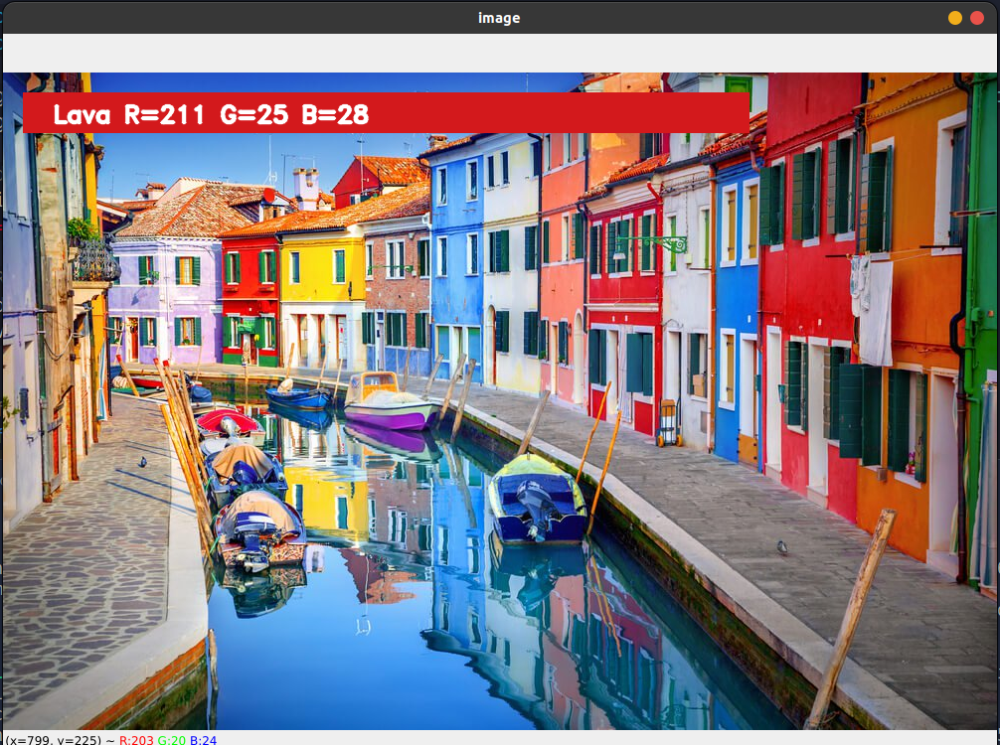

# Color Detection using OpenCV

## Demo

Author: MOhit Sharma

This Python program uses the OpenCV library to detect and identify colors in an image. It provides the name of the color and its corresponding RGB values when you double-click on a pixel in an image. This readme.md file will explain what this program does, its applications, and how to use it.

## Table of Contents
- [How It Works](#how-it-works)
- [Applications](#applications)
- [How to Use](#how-to-use)
- [Demo](#demo)
- [License](#license)

## How It Works

The Color Detection program works as follows:
1. It reads an image from a specified file path.
2. When you double-click on a pixel in the image, it captures the color of that pixel.
3. It calculates the RGB values of the selected color and identifies the nearest matching color from a predefined list of colors.
4. It displays the selected color's name and RGB values on the image.

## Applications

The Color Detection program can be used in various applications, including:
- Graphic Design: Identifying and using specific colors in graphic design projects.
- Image Editing: Quickly determining the color of a pixel in an image.
- Color Measurement: Measuring and categorizing colors for scientific or industrial purposes.
- Educational Tool: Teaching color recognition and RGB values.

## How to Use

Follow these steps to use the Color Detection program:
1. Ensure you have Python and OpenCV installed on your system.
2. Download or provide the path to an image you want to analyze. Replace the `img_path` variable with the image's path.
3. Run the Python script.
4. An OpenCV window will open displaying the image.
5. Double-click on any pixel in the image, and the program will display the color's name and RGB values in a rectangle below the image.
6. If the color is very light, the text will be displayed in black to ensure visibility.
7. To exit the program, press the 'esc' key in the OpenCV window.

The above image demonstrates the Color Detection program in action.

## License

This project is licensed under the [License Name] License - see the [LICENSE](LICENSE) file for details.

---

Enjoy experimenting with colors and have fun using the Color Detection program!
